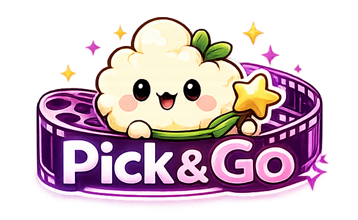
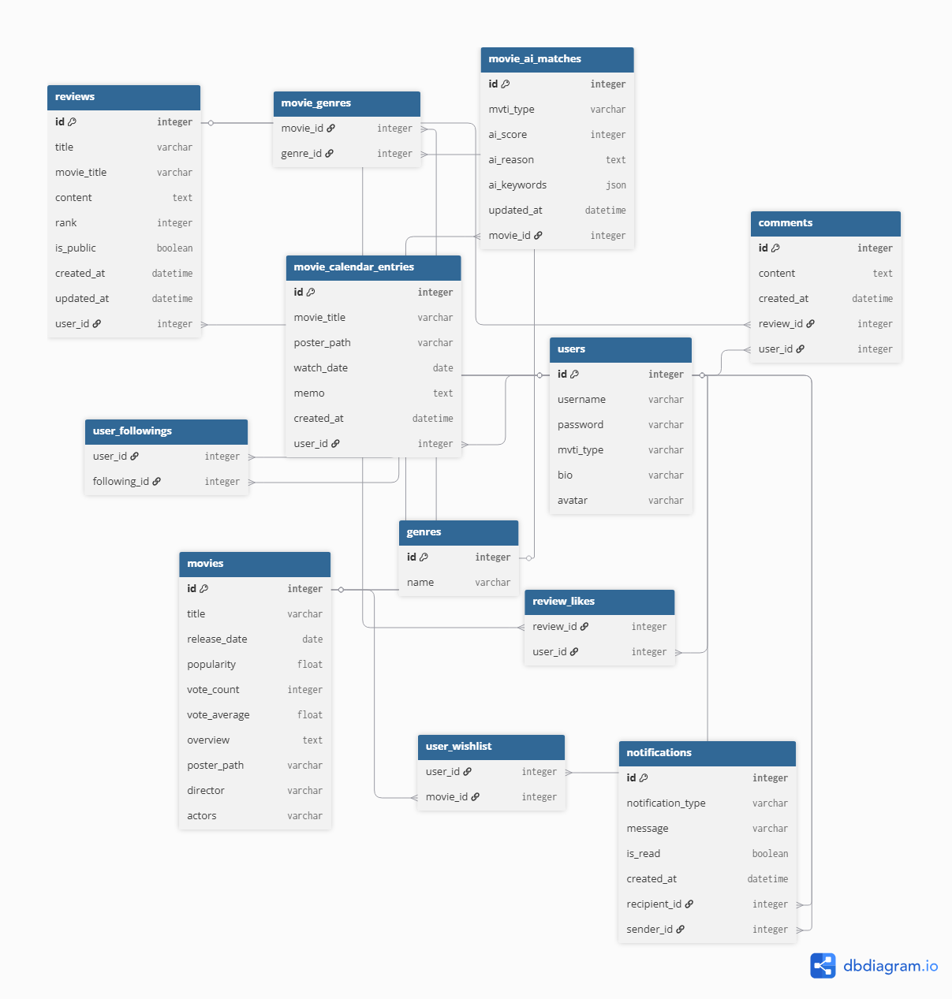
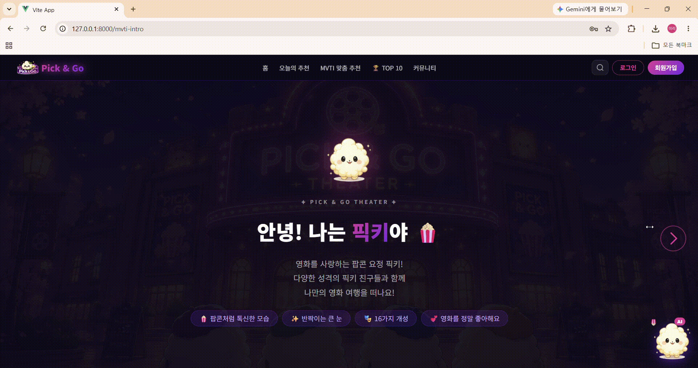
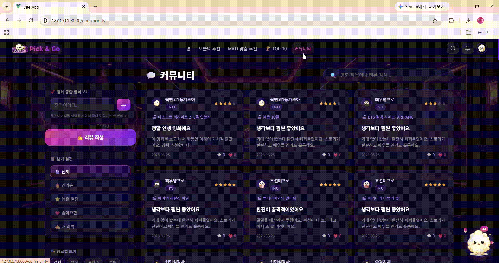
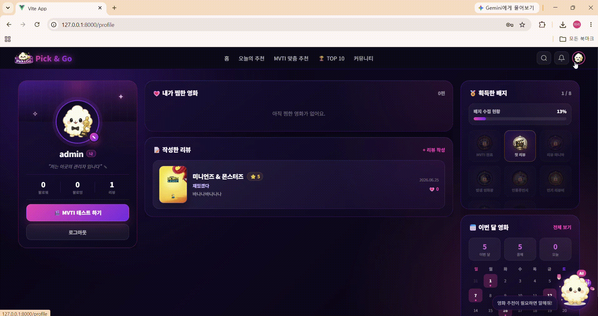

# 🎬 Pick & Go

<div align="center">

[Pick & Go Banner]


## **Find Your Movie, Find Yourself**

> 오늘의 감정과 나만의 영화 취향 유형인 **MVTI**를 기반으로
> 사용자에게 딱 맞는 영화를 추천하는 **개인 맞춤형 영화 추천 커뮤니티 서비스**

<br>

**SSAFY 15기 부울경 1반 3팀 | 13-PJT 웹 애플리케이션 프로젝트**

`Django 5.2` `Vue 3` `Python` `SQLite` `TMDB API` `YouTube API` `GMS API`

</div>

---

## 📌 목차

| 구분 | 내용                                          |
| -- | ------------------------------------------- |
| A  | [팀원 정보 및 업무 분담](#a-팀원-정보-및-업무-분담)           |
| B  | [목표 서비스 및 실제 구현 정도](#b-목표-서비스-및-실제-구현-정도)   |
| C  | [데이터베이스 모델링 ERD](#c-데이터베이스-모델링-erd)         |
| D  | [추천 알고리즘 기술 설명](#d-추천-알고리즘-기술-설명)           |
| E  | [핵심 기능 설명](#e-핵심-기능-설명)                     |
| F  | [생성형 AI 활용](#f-생성형-ai-활용)                   |
| G  | [AI 구현 산출물 및 캡처 자료](#g-ai-구현-산출물-및-캡처-자료)   |
| H  | [서비스 URL 및 실행 방법](#h-서비스-url-및-실행-방법)       |
| I  | [개발 과정, 어려웠던 점, 배운 점](#i-개발-과정-어려웠던-점-배운-점) |

---

# A. 팀원 정보 및 업무 분담

## 👥 팀원

| 이름  | 역할                       | 담당 영역                                                              |
| --- | ------------------------ | ------------------------------------------------------------------ |
| 진미리 | 팀장 / 프론트엔드 / UI·UX / 데이터 | 전체 UI 디자인, MVTI 결과 화면, 영화 달력, 커뮤니티, 배지·알림, 더미 데이터, 픽키 챗봇 UI        |
| 김수원 | 백엔드 / 추천 알고리즘 / AI 연동    | MVTI 추천 알고리즘, 오늘의 추천, 친구 궁합, TOP10 PickScore, GMS 프롬프트, TMDB 영화 수집 |

---

## 🌿 Git 협업 방식

### 브랜치 전략

```text
main
├── miri4    # 진미리 개발 브랜치
└── suwon4   # 김수원 개발 브랜치
```

각 팀원은 개인 브랜치에서 기능을 구현한 뒤, 동작 확인 후 `main` 브랜치로 병합했다.

### 커밋 컨벤션

| 태그         | 의미                         |
| ---------- | -------------------------- |
| `feat`     | 새로운 기능 추가                  |
| `fix`      | 버그 수정                      |
| `style`    | UI/CSS 수정                  |
| `refactor` | 코드 구조 개선                   |
| `docs`     | 문서 수정                      |
| `data`     | 영화 데이터, fixture, 더미 데이터 관련 |
| `chore`    | 환경 설정, 빌드 설정               |

### Git 캡처 자료

| 캡처 항목          | 파일 경로                            |
| -------------- | -------------------------------- |
| GitLab 커밋 내역   | `./images/git_commits.png`       |
| Git 브랜치 목록     | `./images/git_branches.png`      |
| Merge 또는 협업 기록 | `./images/git_merge_history.png` |

> 📸 `git_commits.png`, `git_branches.png`는 Git 활용 증빙 자료로 README와 발표자료에 함께 첨부한다.

---

## 📅 개발 일정

| 단계          | 내용                                  | 기간          |
| ----------- | ----------------------------------- | ----------- |
| 1. 기획 및 설계  | 서비스 주제 선정, 요구사항 분석, ERD 설계          | 6/22        |
| 2. 백엔드 구현   | Django 모델, API, TMDB 연동, 추천 알고리즘 구현 | 6/22 ~ 6/23 |
| 3. 프론트엔드 구현 | Vue SPA 화면 구성, 라우팅, UI 구현           | 6/23 ~ 6/24 |
| 4. 통합 및 테스트 | API 연결, 오류 수정, 더미 데이터 생성, 시연 흐름 점검  | 6/24 ~ 6/25 |
| 5. 발표 준비    | README, 발표자료, 시연 시나리오 정리            | 6/25 ~ 6/26 |


---

# B. 목표 서비스 및 실제 구현 정도

## 🎯 프로젝트 주제

**Pick & Go**는 사용자의 현재 감정, 영화 취향 유형인 **MVTI**, 영화 데이터, 친구의 취향 정보를 종합해 영화를 추천하는 서비스다.

기존 영화 추천 서비스는 주로 평점, 인기도, 과거 시청 기록에 의존한다.
하지만 실제로 영화를 고를 때는 “오늘의 기분”, “내가 선호하는 영화 분위기”, “친구와 함께 볼 수 있는지”도 중요하다.

따라서 Pick & Go는 다음 문제를 해결하고자 했다.

| 문제 상황                         | 해결 방향                       |
| ----------------------------- | --------------------------- |
| 볼 영화는 많지만 무엇을 볼지 고르기 어려움      | 감정 기반 AI 추천 제공              |
| 사용자가 자신의 영화 취향을 명확히 알기 어려움    | MVTI 영화 취향 테스트 제공           |
| 단순 평점순 추천은 개인 취향을 충분히 반영하지 못함 | MVTI 장르 벡터와 AI 매칭 점수 활용     |
| 친구와 함께 볼 영화를 고르기 어려움          | 친구 궁합률과 함께 보기 좋은 영화 추천      |
| 영화 선택 자체가 피로하게 느껴짐            | 랜덤 영화 뽑기로 가볍고 재미있는 탐색 경험 제공 |
| 추천, 기록, 리뷰가 분산되어 있음           | 추천 + 탐색 + 커뮤니티 + 달력 기록 통합   |

---

## 🌟 Pick & Go의 차별점

| 차별점            | 설명                                            |
| -------------- | --------------------------------------------- |
| 🎭 감정 기반 추천    | 사용자가 오늘 느끼는 감정을 기반으로 영화 추천                    |
| 🧬 MVTI 개인화    | MBTI를 영화 취향에 맞게 변형한 MVTI 유형으로 취향 분석           |
| 🤖 AI 큐레이션     | GMS API를 활용해 감정과 MVTI를 함께 고려한 추천 이유 생성        |
| 🎲 랜덤 영화 뽑기    | 고르기 어려운 사용자를 위해 영화 선택을 놀이처럼 경험할 수 있는 랜덤 추천 제공 |
| 👫 친구 궁합       | 친구와의 MVTI, 장르, 찜/리뷰 데이터를 비교해 궁합률 계산           |
| 🍿 함께 보기 좋은 영화 | 한 사람의 취향이 아니라 두 사람의 공통 취향을 기준으로 추천            |
| 📅 기록 기능       | 영화 달력으로 감상 기록을 날짜별로 저장                        |
| 💬 커뮤니티 연결     | 추천, 감상, 리뷰, 댓글, 좋아요, 알림을 하나의 흐름으로 연결          |

---

## 🎲 랜덤 영화 뽑기 기획 의도

Pick & Go는 추천 알고리즘뿐만 아니라, 사용자가 영화를 고르는 과정 자체를 더 재미있게 만들기 위해 **랜덤 영화 뽑기** 기능을 제공한다.

영화 선택에 오래 고민하는 사용자는 버튼 한 번으로 예상하지 못한 영화를 추천받을 수 있으며, 이는 단순한 목록 탐색이 아니라 “오늘은 어떤 영화가 나올까?”라는 가벼운 재미를 제공한다.

| 항목    | 내용                            |
| ----- | ----------------------------- |
| 목적    | 영화 선택 피로도 감소                  |
| 방식    | 버튼 클릭 시 랜덤 영화 추천              |
| 특징    | 사용자가 예상하지 못한 영화를 발견하는 재미 제공   |
| 기대 효과 | 탐색 경험을 놀이처럼 만들고, 다양한 영화 노출 가능 |

---

## ✅ 필수 요구사항 구현 현황

| 요구사항              | 구현 내용                                                | 구현 여부 |
| ----------------- | ---------------------------------------------------- | ----- |
| F1301 영화 추천       | 오늘의 추천, MVTI 맞춤 추천, TOP10, 친구와 함께 보기 좋은 영화, 랜덤 영화 뽑기 | ✅     |
| F1302 API 활용      | TMDB API, YouTube API, GMS API 활용                    | ✅     |
| F1303 영화 커뮤니티     | 리뷰 작성, 댓글, 좋아요, 장르 필터, 정렬, 알림                        | ✅     |
| F1304 RESTful 설계  | 기능별 URL 분리, HTTP Method 기반 API 구성                    | ✅     |
| NF1301 Git 활용     | 브랜치 분리, 커밋 컨벤션 적용                                    | ✅     |
| NF1302 API Key 관리 | `.env`를 통한 API Key 관리                                | ✅     |
| NF1303 영화 데이터 확보  | TMDB 기반 영화 데이터 2,604편 확보                             | ✅     |
| NF1304 페이지 다양성    | 17개 이상 URL 및 페이지 구성                                  | ✅     |
| 심화 AI 활용          | GMS 기반 생성형 AI 추천 및 챗봇 구현                             | ✅     |

---

## 📊 주요 페이지 구성

| URL                  | 페이지        | 주요 기능                      |
| -------------------- | ---------- | -------------------------- |
| `/`                  | 홈          | 서비스 소개, 추천 진입              |
| `/mood`              | 오늘의 추천     | 감정 선택, 명대사 선택, AI 영화 추천    |
| `/mvti-intro`        | MVTI 소개    | MVTI 테스트 소개                |
| `/mvti-test`         | MVTI 테스트   | 8문항 영화 취향 테스트              |
| `/mvti-result`       | MVTI 결과    | MVTI 유형, 포토카드, 추천 영화       |
| `/recommended`       | MVTI 맞춤 추천 | 성향 기반 영화 추천                |
| `/platform`          | TOP10      | PickScore 기반 랭킹            |
| `/cinema`            | 현재 상영작     | 현재 상영 영화와 예매 링크            |
| `/friend-match`      | 친구 궁합      | 친구와의 영화 취향 궁합              |
| `/movies`            | 영화 탐색      | 영화 검색, 장르 필터, 정렬, 랜덤 영화 뽑기 |
| `/movies/:id`        | 영화 상세      | 영화 정보, 예고편, 궁합률            |
| `/community`         | 커뮤니티       | 리뷰 피드, 좋아요, 장르 필터          |
| `/community/create`  | 리뷰 작성      | 영화 리뷰 작성                   |
| `/community/:id`     | 리뷰 상세      | 댓글 작성, 최신순/과거순 정렬          |
| `/calendar`          | 영화 달력      | 날짜별 영화 기록                  |
| `/profile`           | 내 프로필      | 찜, 리뷰, 배지, 달력 통계           |
| `/profile/:username` | 친구 프로필     | 친구 정보, 활동 확인               |

---

# C. 데이터베이스 모델링 ERD

## ERD

[Pick & Go ERD]


---

## 주요 테이블

| 테이블                    | 설명                                         |
| ---------------------- | ------------------------------------------ |
| `User`                 | 사용자 계정, MVTI 유형, 프로필, 아바타 정보               |
| `Movie`                | TMDB 기반 영화 정보, 평점, 인기도, 줄거리, 포스터, 감독·배우 정보 |
| `Genre`                | 영화 장르 정보                                   |
| `Review`               | 사용자가 작성한 영화 리뷰                             |
| `Comment`              | 리뷰에 달린 댓글                                  |
| `Notification`         | 팔로우, 좋아요, 댓글 알림                            |
| `MovieCalendarEntry`   | 사용자의 날짜별 영화 기록                             |
| `MovieAiMatch`         | 영화와 MVTI 유형별 AI 매칭 점수, 추천 이유, 키워드          |
| `User_Followings`      | 사용자 간 팔로우 관계                               |
| `User_Wishlist_Movies` | 사용자 찜 영화 관계                                |
| `Movie_Genres`         | 영화와 장르의 다대다 관계                             |
| `Review_Like_Users`    | 리뷰 좋아요 관계                                  |

---

## 관계 요약

| 관계                        | 설명                                        |
| ------------------------- | ----------------------------------------- |
| User - Review             | 한 명의 사용자는 여러 리뷰를 작성할 수 있다                 |
| User - Comment            | 한 명의 사용자는 여러 댓글을 작성할 수 있다                 |
| Review - Comment          | 하나의 리뷰에는 여러 댓글이 달릴 수 있다                   |
| User - Notification       | 사용자는 알림을 받거나 보낼 수 있다                      |
| User - MovieCalendarEntry | 사용자는 여러 영화 기록을 남길 수 있다                    |
| Movie - MovieAiMatch      | 하나의 영화는 MVTI 16유형별 AI 매칭 데이터를 가질 수 있다     |
| User - Movie              | 사용자는 여러 영화를 찜할 수 있고, 영화도 여러 사용자에게 찜될 수 있다 |
| Movie - Genre             | 하나의 영화는 여러 장르를 가질 수 있다                    |
| User - User               | 사용자는 다른 사용자를 팔로우할 수 있다                    |
| Review - User             | 리뷰는 여러 사용자에게 좋아요를 받을 수 있다                 |

---

# D. 추천 알고리즘 기술 설명

Pick & Go의 추천 시스템은 단순 평점순이 아니라, 사용자의 데이터 보유 여부에 따라 다른 추천 기준을 적용한다.

```text
사용자 데이터가 충분한 경우
→ MVTI 성향 + AI 매칭 + 평점 + 인기도 기반 개인화 추천

사용자 데이터가 부족한 경우
→ 감정 + 장르 + 평점 + 인기도 기반 추천
```

---

## 1. 오늘의 추천: 감정 기반 AI 추천

### 추천 흐름

```text
1. 사용자가 오늘의 감정 선택
2. 감정에 어울리는 명대사 선택
3. 감정 키워드를 영화 장르로 매핑
4. 후보 영화 1차 필터링
5. GMS AI가 후보 영화 중 최종 추천 영화 선택
6. AI 추천 리포트 출력
```

### 점수 기준

| 항목         |   배점 |
| ---------- | ---: |
| 오늘 감정 궁합   |  60점 |
| MVTI 취향 매칭 |  30점 |
| 평점/대중성     |  10점 |
| 총점         | 100점 |

### 특징

* AI가 아무 영화나 생성하지 않도록 DB에 있는 후보 영화 목록 안에서만 선택하도록 제한했다.
* 이미 추천된 영화 ID를 제외해 중복 추천을 방지했다.
* MVTI가 없는 사용자도 감정, 장르, 평점, 인기도를 기반으로 추천받을 수 있다.

---

## 2. MVTI 맞춤 추천

MVTI는 MBTI를 영화 취향에 맞게 변형한 Pick & Go만의 영화 취향 유형이다.

각 글자별로 선호 장르 가중치를 부여하고, 영화 장르와 사용자의 MVTI 장르 벡터가 얼마나 잘 맞는지 계산한다.

### 계산 기준

| 항목         | 설명                              |
| ---------- | ------------------------------- |
| MVTI 장르 벡터 | E/I, N/S, T/F, J/P별 선호 장르 가중치   |
| 평점 점수      | TMDB `vote_average` 반영          |
| 인기도 점수     | TMDB `popularity` 반영            |
| 투표 수 점수    | `vote_count`를 활용한 신뢰도 보정        |
| AI 매칭 점수   | `MovieAiMatch`에 저장된 MVTI별 AI 점수 |

### 최종 궁합률

```python
match_percent = max(35, min(rule_score + ai_score, 98))
```

최종 궁합률은 규칙 기반 점수와 AI 매칭 점수를 합산하되, 너무 낮거나 높은 값이 나오지 않도록 35%~98% 사이로 제한했다.

---

## 3. TOP10 PickScore

TOP10은 단순 궁합률 순위가 아니라, 개인화 점수와 대중성 지표를 함께 반영한다.

```python
pick_score = (
    match_percent * 0.62
  + ai_score * 0.9
  + rule_score * 0.35
  + vote_average * 2.2
  + min(popularity / 20, 8)
  + min(vote_count / 1000, 5)
)
```

| 항목              | 의미                    |
| --------------- | --------------------- |
| `match_percent` | 사용자 MVTI와 영화의 최종 궁합률  |
| `ai_score`      | GMS가 분석한 MVTI별 영화 적합도 |
| `rule_score`    | 장르 벡터 기반 규칙 점수        |
| `vote_average`  | 영화 평점                 |
| `popularity`    | TMDB 인기도              |
| `vote_count`    | 투표 수 기반 신뢰도           |

---

## 4. 친구 궁합

친구 궁합은 두 사용자의 MVTI와 실제 활동 데이터를 함께 반영한다.

```text
친구 궁합률
= MVTI 글자 유사도 40점
+ MVTI 선호 장르 유사도 35점
+ 찜/리뷰 기반 실제 취향 유사도 25점
```

| 항목          |  배점 | 설명                       |
| ----------- | --: | ------------------------ |
| MVTI 글자 유사도 | 40점 | 네 글자의 일치 정도를 가중치로 계산     |
| 선호 장르 유사도   | 35점 | 두 사용자의 MVTI 선호 장르 교집합 비율 |
| 찜/리뷰 유사도    | 25점 | 실제 찜, 리뷰 활동 장르의 교집합 비율   |

친구와 함께 보기 좋은 영화는 두 사람의 MVTI 선호 장르, 찜한 영화, 리뷰 작성 영화의 장르를 함께 고려해 추천한다.

---

## 5. 랜덤 영화 뽑기

랜덤 영화 뽑기는 정교한 조건 입력 없이도 사용자가 영화 탐색을 시작할 수 있게 하는 기능이다.

```text
사용자가 랜덤뽑기 버튼 클릭
→ 후보 영화 중 랜덤 선택
→ 영화 카드 또는 상세 정보 표시
→ 사용자는 새로운 영화 발견 경험 획득
```

이 기능은 알고리즘의 복잡성보다 사용자의 실제 경험에 초점을 맞춘 기능으로, 영화 선택에 피로를 느끼는 사용자가 부담 없이 서비스를 사용할 수 있도록 돕는다.

---

## 6. 추천 예외 처리

| 상황                  | 처리 방식                   |
| ------------------- | ----------------------- |
| 비로그인 사용자가 개인화 기능 접근 | 로그인 페이지로 이동             |
| MVTI가 없는 사용자        | 감정, 장르, 평점, 인기도 기반 추천   |
| AI 매칭 데이터가 없는 영화    | 규칙 기반 점수로 보완            |
| 추천 후보가 부족한 경우       | 전체 인기 영화와 고평점 영화로 후보 보완 |
| AI 응답 실패            | fallback 추천 로직으로 대체     |
| 이전 추천과 중복           | 추천된 영화 ID를 제외 목록에 저장    |
| 선택 피로가 있는 사용자       | 랜덤 영화 뽑기로 즉시 추천 제공      |

---

# E. 핵심 기능 설명

## 0. 홈화면


* Pick & Go Theater 컨셉의 메인 히어로 섹션
* 스크롤에 따라 서비스 주요 기능 소개 (MVTI · 감정 추천 · TOP 10 · 친구 궁합 · 커뮤니티)
* 비로그인 상태에서도 전체 랜딩 페이지 탐색 가능
* 우측 하단 AI 챗봇 픽키 상시 노출

---

## 1. MVTI 테스트 🎭




* 8문항 영화 취향 테스트
* 답변에 따라 E/I, N/S, T/F, J/P 성향 계산
* 16가지 MVTI 유형 중 하나로 분류
* 비로그인 상태에서도 테스트 가능
* 로그인 후 결과를 사용자 프로필에 저장

---

## 2. MVTI 결과 카드 🏆


* MVTI 유형별 포토카드 제공
* 유형 설명, 취향 키워드, 추천 영화 제공
* 사용자가 자신의 영화 취향을 직관적으로 이해할 수 있도록 구성

---

## 3. 오늘의 추천 🎟️


* 사용자가 오늘의 감정을 선택
* 감정에 맞는 명대사를 선택
* GMS AI가 감정, MVTI, 평점 정보를 종합해 영화 추천
* 추천 이유와 매칭률을 리포트 형태로 제공
* “조금 더 잔잔하게”, “더 신나게” 등 추가 요청 가능

---

## 4. 픽키 AI 챗봇 🤖


* 사용자가 자연어로 원하는 영화를 요청할 수 있다.
* 예: “슬픈 날 위로받을 영화 추천해줘”, “90년대 명작 추천해줘”
* 일상적인 질문에도 답변한 뒤 영화 추천으로 자연스럽게 연결한다.
* 추천 영화는 카드 형태로 표시한다.

---

## 5. TOP10 🍿


* 로그인 사용자는 MVTI 기반 개인화 TOP10 제공
* 비로그인 사용자는 평점, 인기도 기반 TOP10 제공
* 1~3위는 시상식 스타일 UI로 강조
* 4~10위는 리스트 형태로 제공

---

## 6. 친구 궁합 👫


* 친구 아이디를 입력하면 영화 취향 궁합률 계산
* MVTI 유사도, 선호 장르, 찜/리뷰 데이터를 종합
* 두 사람에게 함께 어울리는 영화 추천

---

## 7. 랜덤 영화 뽑기 🎲


* 사용자가 직접 조건을 고르지 않아도 버튼 한 번으로 영화를 추천받을 수 있다.
* 영화 선택에 피로를 느끼는 사용자를 위해 가볍고 재미있는 탐색 경험을 제공한다.
* 평점, 인기도, 장르 기반 추천과 달리 “예상하지 못한 발견”을 중심으로 설계했다.
* 추천 서비스에 게임적 요소를 더해 사용자가 부담 없이 영화를 탐색할 수 있도록 했다.

---

## 8. 영화 탐색 🔍


* 제목, 감독, 배우 통합 검색
* 장르 필터와 정렬 기능 제공
* 영화 상세 페이지에서 예고편, 줄거리, 평점, 궁합률 확인
* 찜하기 기능 제공

---

## 9. 커뮤니티 💬



* 영화 리뷰 작성
* 댓글 작성
* 댓글 최신순/과거순 정렬
* 리뷰 좋아요
* 장르별 리뷰 필터
* 팔로우, 좋아요, 댓글 알림

---

## 10. 영화 달력 📅



* 날짜별 감상 영화 기록
* 포스터와 메모 저장
* DB 저장 방식으로 구현하여 다른 기기에서도 기록 유지
* 프로필에서 월별/연간 감상 통계 확인

---

## 11. 배지 시스템 🏅


| 배지      | 획득 조건            |
| ------- | ---------------- |
| MVTI 완료 | MVTI 테스트 완료      |
| 첫 리뷰    | 첫 리뷰 작성          |
| 팔로워 10명 | 팔로워 10명 달성       |
| 달력 영화왕  | 달력에 영화 10편 이상 기록 |
| 인플루언서   | 받은 좋아요 20개 이상    |
| 영화 마니아  | 찜한 영화 20편 이상     |
| 파티 참가자  | 팔로잉 5명 이상        |
| 시네마     | 댓글 10개 이상 작성     |

---

# F. 생성형 AI 활용

## 🤖 AI 활용 개요

Pick & Go는 단순히 생성형 AI를 코드 작성 보조로만 사용하지 않고, 실제 서비스 기능 안에 GMS 기반 AI를 적용했다.

| 기능         | 사용 모델                  | 활용 방식                     |
| ---------- | ---------------------- | ------------------------- |
| 오늘의 추천     | GMS API / GPT-4.1-mini | 감정, 명대사, MVTI를 바탕으로 영화 추천 |
| 픽키 챗봇      | GMS API / GPT-4.1-mini | 자연어 대화를 기반으로 영화 추천        |
| MVTI AI 매칭 | GMS API / GPT-4.1-mini | 영화와 MVTI 16유형별 적합도 사전 생성  |
| 개발 보조      | 생성형 AI                 | 오류 원인 분석, 프롬프트 개선, 문서화 보조 |

---

## 1. 오늘의 추천 AI

사용자가 선택한 감정과 명대사를 바탕으로 후보 영화를 만들고, GMS AI가 후보 영화 중 최종 추천 영화를 선택한다.

```text
감정 선택
→ 명대사 선택
→ 감정 키워드 분석
→ 장르 매핑
→ 후보 영화 목록 생성
→ GMS AI 추천
→ AI 리포트 출력
```

### 프롬프트 설계 포인트

| 설계 요소            | 목적               |
| ---------------- | ---------------- |
| 후보 영화 목록 안에서만 선택 | 존재하지 않는 영화 추천 방지 |
| 점수 기준 명시         | 추천 결과의 일관성 확보    |
| JSON 형식 응답 강제    | 프론트엔드 파싱 안정성 확보  |
| 감정별 추천 기준 명시     | 감정에 맞는 영화 분위기 유도 |
| 이미 추천된 영화 제외     | 중복 추천 방지         |

---

## 2. 픽키 AI 챗봇

픽키 챗봇은 사용자의 자연어 요청을 분석해 영화 추천으로 연결한다.

예시 요청:

```text
슬픈 날 위로받을 영화 추천해줘
90년대 명작 추천해줘
친구랑 볼만한 가벼운 코미디 영화 있어?
짧고 몰입감 있는 공포 영화 보고 싶어
```

### 챗봇 특징

* 일상 질문도 먼저 짧게 답변한다.
* 답변을 영화 추천으로 자연스럽게 연결한다.
* 후보 영화 목록 안에서만 추천한다.
* 추천 영화는 카드 UI로 보여준다.
* 이전에 추천한 영화는 제외해 중복을 줄인다.

---

## 3. MVTI AI 매칭 데이터 생성

`MovieAiMatch` 테이블은 영화와 MVTI 16가지 유형의 적합도를 미리 저장한다.

```bash
python manage.py generate_ai_matches --limit 150
```

위 명령어를 실행하면 다음과 같은 AI 매칭 데이터가 생성된다.

```text
영화 150편 × MVTI 16유형 = 약 2,400개 AI 매칭 데이터
```

저장되는 데이터:

| 필드            | 설명               |
| ------------- | ---------------- |
| `movie`       | 분석 대상 영화         |
| `mvti_type`   | MVTI 유형          |
| `ai_score`    | AI 적합도 점수        |
| `ai_reason`   | 해당 MVTI와 어울리는 이유 |
| `ai_keywords` | 추천 키워드           |

이 데이터는 MVTI 맞춤 추천, TOP10, 영화 상세 궁합률 계산에 활용된다.

---

## 4. 프롬프트 엔지니어링 원칙

| 원칙               | 목적                   |
| ---------------- | -------------------- |
| 후보 영화 목록 안에서만 선택 | AI 환각 방지             |
| JSON 형식으로만 응답    | 파싱 안정성 확보            |
| 이미 추천한 영화 제외     | 중복 추천 방지             |
| 감정별 추천 기준 명시     | 사용자 감정에 맞는 추천 유도     |
| 점수 기준 명시         | 추천 결과의 일관성 확보        |
| fallback 로직 구성   | AI API 실패 시에도 서비스 유지 |

---

## 5. AI 응답 JSON 예시

```json
{
  "vibe": "잔잔한 위로",
  "reason": "오늘의 감정에는 조용히 공감하고 회복할 수 있는 영화가 잘 어울립니다.",
  "picks": [
    {
      "id": 123,
      "emotion_score": 55,
      "mvti_score": 24,
      "popularity_score": 8,
      "match_percent": 87,
      "comment": "감정선을 천천히 따라가며 위로를 받을 수 있는 영화입니다."
    }
  ]
}
```

---

## 6. 개발 과정에서의 AI 활용

* MVTI 유형별 성향 설명문 초안 작성
* 추천 프롬프트 구조 설계
* AI 응답 JSON 파싱 오류 해결 방향 탐색
* 더미 리뷰 문장 다양화
* 오류 원인 분석과 해결 아이디어 도출
* README 및 발표자료 초안 구성 보조

---

# G. AI 구현 산출물 및 캡처 자료

관통 프로젝트 AI 구현 안내에 따라, 발표자료와 README에는 **AI 구현 내용, 사용 프롬프트, 주요 코드 캡처**를 함께 정리한다.

---

## 1. AI 구현 내용 요약

| 구분            | 구현 내용                       | 관련 파일                                                    |
| ------------- | --------------------------- | -------------------------------------------------------- |
| 오늘의 추천 AI     | 감정·명대사·MVTI 기반 영화 추천        | `movies/views.py`                                        |
| 픽키 챗봇         | 자연어 요청 기반 영화 추천             | `movies/views.py`, `frontend/src/components/ChatBot.vue` |
| MVTI AI 매칭 생성 | 영화 × MVTI 16유형별 AI 점수 사전 생성 | `movies/management/commands/generate_ai_matches.py`      |
| AI 결과 화면      | 추천 이유, 매칭률, 키워드 출력          | `frontend/src/views/MoodRecommendView.vue`               |
| 중복 추천 방지      | 이미 추천한 영화 ID 제외             | `MoodRecommendView.vue`, `movies/views.py`               |
| AI 실패 대응      | fallback 추천 로직              | `movies/views.py`                                        |

---

## 2. 사용 프롬프트 캡처

| 캡처 항목                | 설명                          | 파일 경로                             |
| -------------------- | --------------------------- | --------------------------------- |
| 오늘의 추천 system prompt | 감정 기반 추천 기준과 JSON 응답 규칙     | `./images/prompt_mood_system.png` |
| 오늘의 추천 user prompt   | 사용자 감정, 명대사, MVTI, 후보 영화 전달 | `./images/prompt_mood_user.png`   |
| 픽키 챗봇 prompt         | 자연어 요청과 후보 영화 기반 추천 규칙      | `./images/prompt_chatbot.png`     |
| MVTI AI 매칭 prompt    | 영화와 MVTI 유형별 적합도 분석         | `./images/prompt_ai_match.png`    |

---

## 3. 주요 코드 캡처

| 캡처 항목                 | 설명                        | 파일 경로                                   |
| --------------------- | ------------------------- | --------------------------------------- |
| 감정 키워드 → 장르 매핑 코드     | 사용자의 감정을 영화 장르 후보로 변환     | `./images/code_mood_genre_mapping.png`  |
| GMS API 호출 코드         | GMS chat completions 요청   | `./images/code_gms_request.png`         |
| AI 응답 JSON 파싱 코드      | JSON 응답 정제 및 파싱           | `./images/code_json_parse.png`          |
| 오늘의 추천 후보 생성 코드       | 후보 영화 필터링 및 추천 요청         | `./images/code_mood_candidates.png`     |
| MVTI 점수 계산 코드         | 장르 벡터 기반 궁합률 계산           | `./images/code_mvti_score.png`          |
| TOP10 PickScore 계산 코드 | TOP10 개인화 랭킹 계산           | `./images/code_pickscore.png`           |
| 친구 궁합 계산 코드           | MVTI·장르·찜/리뷰 기반 궁합률 계산    | `./images/code_friend_match.png`        |
| 랜덤 영화 뽑기 코드           | 랜덤 추천 버튼 및 영화 선택 로직       | `./images/code_random_pick.png`         |
| MovieAiMatch 생성 코드    | `generate_ai_matches` 커맨드 | `./images/code_generate_ai_matches.png` |
| 로그아웃 캐시 삭제 코드         | 이전 추천 결과가 남는 문제 해결        | `./images/code_logout_cache_clear.png`  |

---

## 4. AI 구현 증빙 화면

| 화면                 | 설명                                | 파일 경로                                    |
| ------------------ | --------------------------------- | ---------------------------------------- |
| 오늘의 추천 결과          | 감정 기반 AI 추천 리포트 화면                | `./images/result_mood_ai.png`            |
| 픽키 챗봇 결과           | 자연어 요청 후 영화 카드 추천 화면              | `./images/result_chatbot_ai.png`         |
| MVTI 추천 결과         | AI 매칭 점수가 반영된 추천 화면               | `./images/result_mvti_recommend.png`     |
| MovieAiMatch DB 확인 | `MovieAiMatch.objects.count()` 결과 | `./images/result_movieaimatch_count.png` |
| GMS 호출 성공 로그       | `generate_ai_matches` 실행 로그       | `./images/result_gms_success_log.png`    |

---

## 5. 기능 화면 캡처 자료

| 화면           | 설명                | 파일 경로                         |
| ------------ | ----------------- | ----------------------------- |
| README 대표 배너 | 서비스 첫인상 이미지       | `./images/readme_banner.png`  |
| ERD          | 데이터베이스 구조         | `./images/pickgo_erd.png`     |
| MVTI 테스트     | 8문항 테스트 화면        | `./images/mvti_test.gif`      |
| MVTI 결과      | 포토카드 및 추천 결과      | `./images/mvti_result.gif`    |
| TOP10        | 개인화 랭킹 화면         | `./images/top10.gif`          |
| 친구 궁합        | 궁합률 및 함께 보기 좋은 영화 | `./images/friend_match.gif`   |
| 랜덤 영화 뽑기     | 랜덤 추천 실행 화면       | `./images/random_pick.gif`    |
| 영화 달력        | 날짜별 감상 기록         | `./images/calendar.gif`       |
| 커뮤니티         | 리뷰와 댓글 기능         | `./images/community.gif`      |
| 프로필          | 배지, 찜, 리뷰, 달력 통계  | `./images/profile_badges.png` |

---

## 6. 주요 프롬프트 예시

### 오늘의 추천 프롬프트 핵심

```text
너는 Pick & Go의 영화 추천 AI 큐레이터야.

반드시 후보 영화 목록 안에서만 영화를 골라야 한다.
존재하지 않는 영화 제목을 새로 만들면 안 된다.

추천 기준:
- 오늘 감정 궁합: 60점
- MVTI 취향 매칭: 30점
- 평점/대중성: 10점

반드시 JSON 형식으로만 응답한다.
```

---

### 픽키 챗봇 프롬프트 핵심

```text
너는 Pick & Go의 마스코트 픽키야.

사용자의 질문에 먼저 짧게 답변한 뒤,
자연스럽게 영화 추천으로 연결해줘.

영화는 반드시 후보 목록 안에서만 추천해.
영화 제목은 카드 UI로 따로 보여줄 수 있도록 내부적으로 구분해줘.
```

---

### MVTI AI 매칭 프롬프트 핵심

```text
당신은 Pick & Go의 AI 영화 취향 분석가입니다.

영화 정보와 사용자의 MVTI 성향 설명을 보고,
이 영화가 해당 MVTI와 얼마나 잘 맞는지 분석하세요.

ai_score는 0점부터 30점 사이의 정수입니다.

반드시 JSON 형식으로만 답변하세요.
```

---

## 7. AI 구현 관련 발표 포인트

```text
Pick & Go는 생성형 AI를 단순히 아이디어 보조 도구로만 사용하지 않고,
실제 서비스 추천 로직 안에 적용했습니다.

오늘의 추천에서는 사용자의 감정과 MVTI를 함께 고려해
후보 영화 중 가장 적합한 영화를 고르도록 했고,

픽키 챗봇에서는 자연어 요청을 영화 추천으로 연결했습니다.

또한 영화와 MVTI 16유형별 AI 매칭 데이터를 미리 생성해
서비스 실행 중 매번 AI를 호출하지 않고도 빠르게 개인화 추천을 제공하도록 설계했습니다.
```

---

# H. 서비스 URL 및 실행 방법

본 프로젝트는 GMS API와 TMDB API Key가 필요한 서비스이므로,
API Key 보안 및 사용 기간 제한을 고려해 별도 배포 대신 로컬 실행 방식으로 시연한다.

---

## 1. 기술 스택

| 구분            | 기술                                        |
| ------------- | ----------------------------------------- |
| Frontend      | Vue 3, Vite, Pinia, Vue Router, Axios     |
| Backend       | Django 5.2                                |
| Database      | SQLite                                    |
| AI            | GMS API, GPT-4.1-mini                     |
| External API  | TMDB API, YouTube API                     |
| Styling       | CSS3, Glassmorphism UI, Responsive Layout |
| Collaboration | Git, GitLab                               |

---

## 2. 로컬 실행 방법

### 저장소 클론

```bash
git clone https://lab.ssafy.com/[저장소 주소]/13-pjt.git
cd 13-pjt
```

### 가상환경 생성 및 패키지 설치

```bash
python -m venv venv
source venv/Scripts/activate
pip install -r requirements.txt
```

### 환경 변수 설정

프로젝트 루트에 `.env` 파일을 생성한다.

```env
SECRET_KEY=your_django_secret_key
TMDB_ACCESS_TOKEN=your_tmdb_access_token
TMDB_API_KEY=your_tmdb_api_key
GMS_API_KEY=your_gms_api_key
GMS_BASE_URL=https://gms.ssafy.io/gmsapi/api.openai.com/v1
GMS_MODEL=gpt-4.1-mini
YOUTUBE_API_KEY=your_youtube_api_key
```

> `.env` 파일은 API Key 보안을 위해 Git에 포함하지 않는다.

---

## 3. 방법 1: 최종 DB 사용

발표용 최종 `db.sqlite3`에는 영화 데이터, 더미 유저, 리뷰, 달력 기록, MVTI AI 매칭 데이터가 포함되어 있다.

```bash
# 제공된 db.sqlite3를 manage.py와 같은 위치에 배치
python manage.py migrate
python manage.py runserver
```

---

## 4. 방법 2: DB를 새로 구성하는 경우

```bash
python manage.py migrate
python manage.py fetch_tmdb --pages 20
python manage.py update_movies
python manage.py update_credits
python manage.py generate_ai_matches --limit 150
python manage.py seed_demo
```

> 주의: `python manage.py flush` 또는 `db.sqlite3` 삭제 후 새로 migrate하면 기존 영화 데이터와 AI 매칭 데이터가 사라질 수 있다.

---

## 5. 프론트엔드 빌드

```bash
cd frontend
npm install
npm run build
cd ..
```

---

## 6. 서버 실행

```bash
python manage.py runserver
```

접속 주소:

```text
http://127.0.0.1:8000
```

---

## 7. 테스트 계정

| 계정    | 비밀번호     | 비고      |
| ----- | -------- | ------- |
| admin | rkskekfk | 관리자     |
| 진미리   | rkskekfk | 더미 사용자  |
| 김수원   | rkskekfk | 더미 사용자  |
| 더미 유저 | rkskekfk | 시연용 사용자 |

---

# I. 개발 과정, 어려웠던 점, 배운 점

## 1. 기술적 도전과 해결

| 문제                 | 원인                        | 해결                              |
| ------------------ | ------------------------- | ------------------------------- |
| API Key 노출 위험      | TMDB, GMS, YouTube API 사용 | `.env`로 환경변수 관리                 |
| 영화 데이터 부족          | 추천 후보가 반복될 위험             | TMDB API로 2,604편 영화 데이터 확보      |
| MVTI 추천 설명 부족      | 단순 규칙 기반 추천만으로는 설득력 부족    | GMS로 영화 × MVTI AI 매칭 데이터 생성     |
| AI가 없는 영화를 추천할 가능성 | 생성형 AI의 환각 문제             | 후보 영화 목록 안에서만 선택하도록 프롬프트 제한     |
| AI 응답 파싱 오류        | JSON 외 문장 포함 가능성          | JSON 형식 강제 및 JSON 부분 추출 로직 구현   |
| 달력 기록 동기화 문제       | localStorage는 브라우저별 저장    | MovieCalendarEntry 모델로 DB 저장 전환 |
| 로그아웃 후 이전 추천 결과 유지 | sessionStorage 캐싱 문제      | 사용자·날짜 기준 저장 키와 로그아웃 시 캐시 삭제    |
| Vue build 실패       | 파일명 대소문자 불일치              | import 경로와 실제 파일명 일치            |
| 댓글 악성 입력 문제        | 사용자 입력 검증 부족              | 키워드 기반 1차 필터링 및 AI 검열 보조        |

---

## 2. 데이터 현황

| 구분         | 내용                                            |
| ---------- | --------------------------------------------- |
| 영화 데이터     | TMDB API 기반 2,604편                            |
| 장르 데이터     | TMDB 기준 19개                                   |
| 감독·배우 정보   | update_credits 커맨드로 수집                        |
| MVTI AI 매칭 | `generate_ai_matches --limit 150` 기준 약 2,400개 |
| 더미 유저      | 32명                                           |
| 더미 리뷰      | 64개                                           |
| 더미 달력 기록   | 유저별 5~7개                                      |

> `MovieAiMatch` 개수는 최종 실행 후 실제 값으로 수정한다.

---

## 3. 프로젝트 구조

```text
13-pjt/
├── accounts/
│   ├── models.py
│   ├── views.py
│   └── urls.py
├── community/
│   ├── models.py
│   ├── views.py
│   └── urls.py
├── movies/
│   ├── models.py
│   ├── views.py
│   ├── urls.py
│   ├── fixtures/
│   └── management/commands/
│       ├── fetch_tmdb.py
│       ├── update_movies.py
│       ├── update_credits.py
│       ├── generate_ai_matches.py
│       └── seed_demo.py
├── mypjt/
│   ├── settings.py
│   └── urls.py
├── frontend/
│   └── src/
│       ├── views/
│       ├── components/
│       ├── stores/
│       └── router/
├── static/
│   └── images/
├── db.sqlite3
├── manage.py
├── requirements.txt
└── README.md
```

---

## 4. 산출물

| 파일                      | 설명                           |
| ----------------------- | ---------------------------- |
| `README.md`             | 프로젝트 소개 및 실행 방법              |
| `추천알고리즘.md`             | 추천 시스템 상세 설명                 |
| `영화데이터_API_설명.md`       | TMDB, YouTube, GMS API 활용 설명 |
| `pickgo_erd.png`        | ERD 이미지                      |
| `db.sqlite3`            | 발표용 최종 데이터베이스                |
| `requirements.txt`      | Python 패키지 목록                |
| `frontend/package.json` | 프론트엔드 의존성 목록                 |

---

## 5. 시연 시나리오

| 순서 | 화면       | 시연 내용                      |
| -: | -------- | -------------------------- |
|  1 | 홈        | 서비스 소개 및 주요 기능 진입          |
|  2 | MVTI 테스트 | 8문항 테스트로 영화 취향 유형 도출       |
|  3 | MVTI 결과  | 포토카드, 유형 설명, 추천 영화 확인      |
|  4 | 오늘의 추천   | 감정 선택 → 명대사 선택 → AI 추천 리포트 |
|  5 | 픽키 챗봇    | 자연어 요청 기반 영화 추천            |
|  6 | TOP10    | PickScore 기반 개인화 랭킹 확인     |
|  7 | 랜덤 영화 뽑기 | 버튼 클릭으로 예상하지 못한 영화 추천      |
|  8 | 친구 궁합    | 친구와의 궁합률 및 함께 보기 좋은 영화 확인  |
|  9 | 커뮤니티     | 리뷰, 댓글 정렬, 좋아요, 알림 확인      |
| 10 | 영화 달력    | 날짜별 영화 기록 및 통계 확인          |
| 11 | 프로필      | 찜, 리뷰, 배지, 달력 통계 확인        |

---

## 6. 팀원 회고

### 진미리

UI와 사용자 경험을 중심으로 서비스를 설계하면서, 단순히 기능이 동작하는 것뿐 아니라 사용자가 자연스럽게 흐름을 따라갈 수 있는 화면 구성이 중요하다는 것을 느꼈다. 특히 영화 달력을 localStorage에서 DB 저장 방식으로 전환하면서 실제 서비스처럼 여러 환경에서 데이터가 유지되는 구조를 고민할 수 있었다.

### 김수원

추천 알고리즘을 구현하면서 평점순 추천만으로는 개인 취향을 충분히 반영하기 어렵다는 것을 느꼈다. MVTI 장르 벡터, 감정 기반 추천, 친구 궁합 계산을 설계하며 사용자 데이터를 어떻게 점수화하고 추천 결과로 연결할지 고민했다. 또한 GMS 프롬프트에서 후보 영화 안에서만 추천하도록 제한하고 JSON 응답을 강제하면서 생성형 AI를 안정적으로 서비스에 적용하는 방법을 배웠다.

---

## 7. 향후 개선 방향

| 개선 방향       | 내용                                       |
| ----------- | ---------------------------------------- |
| 배포          | API Key 관리와 서버 환경을 정리해 외부 접속 가능한 서비스로 확장 |
| 추천 고도화      | 사용자의 실제 클릭, 찜, 리뷰 데이터를 지속 반영             |
| AI 비용 최적화   | 자주 사용하는 AI 매칭 결과 캐싱 및 재사용                |
| 데이터 자동 업데이트 | 주기적으로 TMDB 최신 영화 데이터를 갱신                 |
| 랜덤 추천 고도화   | 단순 랜덤을 넘어 감정·장르·사용자 취향이 반영된 랜덤 추천으로 발전   |
| 반응형 개선      | 모바일 환경에서도 모든 화면이 안정적으로 보이도록 개선           |
| 소셜 기능 확장    | 친구 추천, 공동 시청 리스트, 그룹 궁합 기능 추가            |

---

## 8. 최종 제출 전 체크리스트

* [ ] `.env` 파일 제외 확인
* [ ] `db.sqlite3`에 영화 데이터 포함 확인
* [ ] `MovieAiMatch.objects.count()` 0이 아닌지 확인
* [ ] `npm run build` 성공 확인
* [ ] `python manage.py migrate` 정상 확인
* [ ] `python manage.py runserver` 정상 실행 확인
* [ ] 로그인/로그아웃 후 오늘의 추천 캐시 문제 없는지 확인
* [ ] MVTI 테스트 → 결과 → 추천 흐름 확인
* [ ] 오늘의 추천 AI 리포트 정상 출력 확인
* [ ] 픽키 챗봇 추천 정상 출력 확인
* [ ] 랜덤 영화 뽑기 정상 동작 확인
* [ ] 친구 궁합 및 함께 보기 좋은 영화 정상 출력 확인
* [ ] README의 이미지 placeholder를 실제 이미지/GIF로 교체
* [ ] 사용 프롬프트 캡처 추가
* [ ] 주요 코드 캡처 추가
* [ ] AI 구현 결과 화면 캡처 추가

---

# 최종 구현 포인트

Pick & Go는 단순히 평점이 높은 영화를 보여주는 서비스가 아니라,
사용자의 현재 감정, MVTI 영화 취향, 영화 평점과 인기도, 친구와의 취향 유사도까지 종합해 추천하는 개인화 영화 추천 서비스다.

사용자 데이터가 충분한 경우에는 MVTI와 활동 데이터를 바탕으로 더 정교한 개인화 추천을 제공하고,
데이터가 부족한 경우에도 감정, 장르, 평점, 인기도를 활용해 추천이 끊기지 않도록 설계했다.

또한 GMS 기반 생성형 AI를 활용해 단순한 영화 목록 제공을 넘어,
“왜 지금 이 영화가 어울리는지”를 사용자의 감정과 상황에 맞춰 설명하도록 구현했다.

마지막으로 랜덤 영화 뽑기를 통해 사용자가 영화를 고르는 과정 자체를 하나의 재미있는 경험으로 느낄 수 있도록 구성했다.

---

<div align="center">

## 🍿 Pick & Go

**진미리 · 김수원**

*"단순한 평점순이 아닌, 감정 + MVTI + AI 큐레이션 + 랜덤뽑기 + 친구 취향을 결합한 영화 추천 서비스"*

</div>
