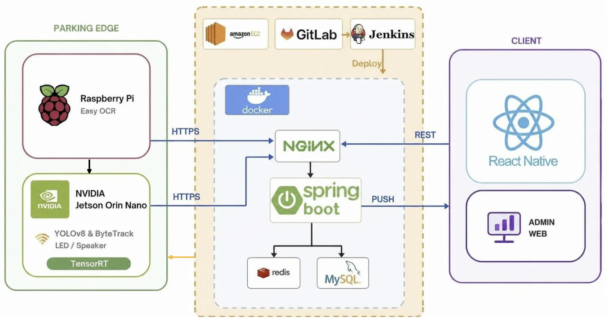
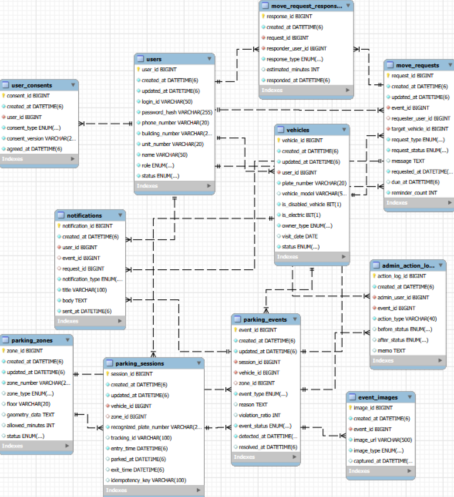
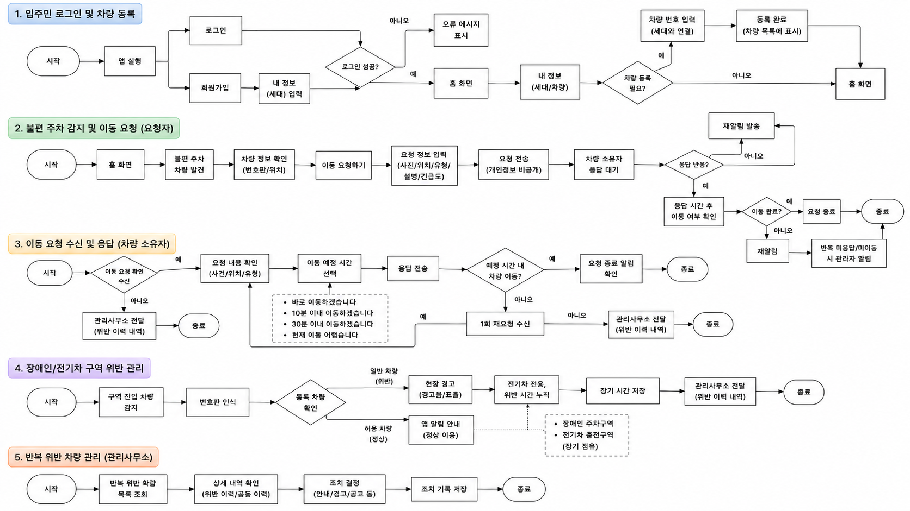

# 🅿️ **스마트 주차장 서비스 [🚗 주차바로🚗]**


[🚖 서비스 번들 다운로드(추가예정)](https://🔺도메인)

[🚘 관리자 웹 바로가기](https://i15e202.p.ssafy.io/admin/)

[🚖 팀 노션 바로가기](https://app.notion.com/p/SSAFY-2-1-396967bab5a4804faef3f3def764090a?source=copy_link)

[🚘 앱/웹 와이어프레임 바로가기 (Figma)](https://www.figma.com/design/zMdVDC8rF1GC2dBgN3tDkT/%EC%8A%A4%EB%A7%88%ED%8A%B8-%EC%A3%BC%EC%B0%A8%EC%9E%A5--%EC%A3%BC%EC%B0%A8%EB%B0%94%EB%A1%9C?node-id=4009-3157&t=wSUHblFHuHAsAXMN-1)

[🚖 ERD 바로가기](https://www.erdcloud.com/d/PfvfjfKdzG5ETYMuB)

[🚘 API 명세서 바로가기 (Swagger)](https://i15e202.p.ssafy.io/api/swagger-ui/index.html#/%EC%B0%A8%EB%9F%89/register)

[🚖 API 명세서 바로가기 (Notion)](https://app.notion.com/p/API-3a4967bab5a480c98ffdf9e7dbb38a2f?source=copy_link)


---

### **목차**


[0. 팀 소개](#0-팀-소개)

[1. 서비스 소개](#1-서비스-소개)

[2. 기술 스택](#2-기술-스택)

[3. 핵심 기능 상세](#3-핵심-기능-상세)

[4. 아키텍처 상세](#4-아키텍처-상세)

[5. 레이아웃 및 디자인](#5-레이아웃-및-디자인)

[6. 프로젝트 산출물](#6-프로젝트-산출물)

---

## 0. 팀 소개

App(모바일 앱·백엔드) · AI · HW(임베디드) 세 영역으로 나누어 개발했고, 담당 도메인 단위로 역할을 나누었습니다.

- 팀장 송가연 — App(Frontend)
- 팀원 김채원 — App(Frontend)
- 팀원 오은서 — 서기, Infra, App(Backend)
- 팀원 박시현 — 스크럼 마스터, AI
- 팀원 박신영 — AI, HW
- 팀원 진미리 — 영상 포트폴리오 담당, AI
- 팀원 최지우 — AIoT 장비 담당, HW

### 🗓️ 구현 기간

🔺2026.07.06 - 08.14

---

## **1. 서비스 소개**

> AI 엣지 디바이스가 아파트 주차장의 불편 주차를 자동으로 감지하고, 차주의 개인정보를 노출하지 않은 채 이동 요청부터 실제 이동 확인까지 중계하는 스마트 주차 관리 서비스
>

### 갈등 없는 주차 문제 해결, 주차바로

아파트 주차장에서 반복적으로 발생하는 이중주차·주차선 침범·장애인 및 전기차 구역 무단 점유를 AI가 자동으로 감지합니다. 
기존에는 위반 차량을 발견해도 차주에게 직접 연락하거나 관리사무소에 신고해야 했고, 이 과정에서 전화번호·세대 정보 같은 개인정보가 노출되고 실제 이동 여부를 다시 확인해야 하는 번거로움이 있었습니다. 
주차바로는 감지 → 이동 요청 → 응답 → 이동 재확인으로 이어지는 흐름을 자동화해 이러한 불편을 줄이는 것을 목표로 합니다.

### **1.1. 타겟 사용자**

- **입주민(거주자)**

    이중주차·주차선 침범·장애인 및 전기차 구역 위반으로 통행에 불편을 겪거나, 위반 차량 신고를 위해 직접 연락처를 알아내야 하는 부담을 겪는 입주민입니다. 
    모바일 앱에서 본인 차량과 방문 차량을 등록하고, 이동 요청 알림을 확인해 예상 이동 시간으로 응답합니다.

- **관리자**

    미응답·미이동 사건, 미등록 차량, 반복 위반 이력을 확인하고 AI 신뢰도가 낮은 사건을 최종 판단하는 관리 주체입니다. 
    회원가입 절차 없이 DB에 관리자 계정으로 생성되어 관리자 권한으로 서비스를 이용합니다.

입주민은 개인정보를 노출하지 않고 위반 차량 이동을 요청할 수 있고, 관리자는 반복적인 현장 확인 업무 부담을 줄일 수 있습니다.

### **1.2. 주요 기능**

| 구분 | 내용 |
| --- | --- |
| 계정·차량 관리 | 회원가입/로그인, 본인 차량 및 방문 차량 등록·조회·수정·삭제 (장애인차·전기차 여부 포함) |
| 입차 인식 | 게이트 카메라 번호판 촬영·OCR, 등록 차량과의 매칭을 통한 입차 판정 |
| 차량 추적 및 주차 판정 | 실내 카메라 기반 차량 탐지·추적, 번호판-트래킹 ID 매칭, 구역 폴리곤 기반 점유·위반(이중주차·구역 외 주차 등) 판정 |
| 이동 요청 | 위반 의심 차량에 대한 이동 요청 등록(사진·사유 첨부) 및 요청 목록 조회 |
| 알림 | 이동 요청·재알림·전기차 구역 초과·사건 종료 등 알림 목록·상세 조회 |
| 장애인·전기차 구역 관리 | 전용 구역 차량 자격 확인, 현장 경고(LED·스피커), 전기차 점유 시간 초과 감지 |

---

## **2. 기술 스택**

### **2.0. 개발 환경**

| 구분 | 내용 |
| --- | --- |
| 개발 언어 | Java, TypeScript, Python |
| 형상 관리 | GitLab |
| 이슈 관리 | Jira |
| 커뮤니케이션 | Notion, Mattermost |

### **2.1. 백엔드**

| 구분 | 기술 |
| --- | --- |
| 언어 / 빌드 | Java 21, Gradle |
| 프레임워크 | Spring Boot 4.1.0 |
| 데이터 접근 | Spring Data JPA, Flyway (DB 마이그레이션) |
| 데이터베이스 | MySQL 8.4 |
| 인증 | Spring Security, JWT (jjwt 0.12.6) |
| API 문서화 | Springdoc OpenAPI(Swagger) 2.8.9 |
| 검증 | Spring Validation |
| 테스트 | JUnit 5, H2(테스트 전용) |

### **2.2. 사용자 앱 (모바일 · baro-app)**

| 구분 | 기술 |
| --- | --- |
| 프레임워크 | Expo SDK 54, React Native 0.81.5, React 19.1.0 |
| 라우팅 | Expo Router 6 |
| 언어 | TypeScript 5.9 |
| 상태 관리 | React Context/Provider 기반 (별도 전역 상태 관리 라이브러리 미사용) |
| 네트워크 통신 | 공통 fetch 래퍼(`services/http-client.ts`) 직접 구현 |
| 인증 · 저장소 | expo-secure-store, @react-native-async-storage/async-storage |
| UI | React Native StyleSheet + 커스텀 디자인 토큰 (별도 UI 라이브러리 미사용) |


### **2.3. 관리자 웹 (baro-web/admin-web)**

| 구분 | 기술 |
| --- | --- |
| 프레임워크 | Vue 3.5 (Composition API, `<script setup>`) |
| 빌드 도구 | Vite 8 |
| 언어 | TypeScript |
| 라우팅 | Vue Router 5 |
| 상태 관리 | Pinia |
| 아이콘 | @lucide/vue |
| 네트워크 통신 | 공통 fetch 래퍼(`services/http-client.ts`) 직접 구현 (baro-app과 동일한 응답 포맷 처리) |
| 인증 · 저장소 | Pinia 스토어(메모리) + `sessionStorage` (`services/session-storage.ts`) |
| 린트 | ESLint, oxlint |

관리자는 사용자 앱(baro-app)과 동일한 백엔드 API를 계정 권한(ADMIN)으로 이용하며, 회원가입 절차 없이 DB에 관리자 계정으로 생성되어 로그인합니다.

### **2.4. 인프라 및 배포**

| 구분 | 기술 |
| --- | --- |
| 서버 | AWS EC2 (Ubuntu) |
| 컨테이너 | Docker, Docker Compose |
| 리버스 프록시 | Nginx |
| CI/CD | Jenkins (Jenkinsfile / Jenkinsfile.cd) |
| 형상 관리 연동 | GitLab (Deploy Key 기반 소스 배포) |

### **2.5. AI / 엣지 디바이스**

| 영역 | 기술 |
| --- | --- |
| 번호판 검출 | YOLOv8n-pose (Ultralytics) — 4점 코너 키포인트 기반 |
| 번호판 인식(OCR) | PaddleOCR (`korean_PP-OCRv5_mobile_rec`) |
| 차량 탐지·추적 | YOLOv8s + ByteTrack |
| 모델 학습 | Ultralytics YOLO, Weights & Biases(실험 관리) |
| 추론 런타임 | ONNX Runtime / NCNN / PaddleLite (Raspberry Pi), ONNX + TensorRT (Jetson) |
| 카메라 보정 | OpenCV fisheye 카메라 캘리브레이션 |
| Edge 서버 | FastAPI (Jetson Orin Nano) |

> 참고: `hw/jetson`은 현재 FastAPI 스켈레톤(헬스체크)만 구현되어 있고, `ai/tracking`의 베이스라인 스크립트를 기반으로 개발이 진행 중입니다.

---

## **3. 핵심 기능 상세**

### **3.1. 회원가입 · 로그인 · 차량 관리**

- **사용 목적**: 입주민이 본인 계정과 차량 정보를 등록해 서비스를 이용할 수 있도록 합니다.
- **주요 이용 흐름**: 회원가입 → 로그인(JWT 발급) → 본인 차량/방문 차량 등록(차량 번호, 장애인차·전기차 여부 포함) → 필요 시 차량 정보 수정·삭제
- **시스템 처리 방식**: `AuthController`(`/auth/signup`, `/auth/login`)가 계정을 생성·인증하고, `VehicleController`가 차량 CRUD를 담당합니다. 관리자 계정은 회원가입이 아닌 DB에 직접 생성됩니다.
- **제공되는 결과**: 로그인한 사용자는 본인 명의 차량과 방문 차량 목록을 앱에서 확인·관리할 수 있습니다.

### **3.2. 게이트 번호판 인식 기반 입차 판정**

- **사용 목적**: 등록된 차량만 정상적으로 입차 처리하고, 인식 결과가 불확실한 경우를 구분합니다.
- **주요 이용 흐름**: 차량이 입구에 진입 → Raspberry Pi가 초음파 센서로 감지 후 번호판을 촬영·인식 → 인식된 번호판을 백엔드에 전송
- **시스템 처리 방식**: Raspberry Pi가 YOLOv8n-pose로 번호판 영역을 검출하고 PaddleOCR로 문자를 인식한 뒤, `HwController`(`POST api/hw/parking/entry`)로 전달합니다. 백엔드는 편집 거리(Levenshtein) 기반 매칭(`PlateMatcher`)으로 등록 차량과 비교해 완전 일치 시 `ALLOW`, 설정된 허용 거리 이내면 `REVIEW`, 그 외에는 `DENY`로 판정하고 `ParkingSession`을 생성합니다. 동일 요청은 idempotency key로 중복 처리되지 않습니다.
- **제공되는 결과**: 등록 차량은 자동으로 입차 처리되고, 인식이 불확실한 차량은 관리자 확인이 필요한 상태로 구분됩니다.

### **3.3. 위반 차량 이동 요청**

- **사용 목적**: 잘못 주차된 차량에 개인정보 노출 없이 이동을 요청합니다.
- **주요 이용 흐름**: 입주민이 위반 차량을 발견 → 앱에서 대상 번호판·위반 유형·사유·사진을 첨부해 이동 요청 등록 → 보낸/받은 이동 요청 목록 조회
- **시스템 처리 방식**: `MoveRequestController`(`POST /move-requests`, `GET /move-requests`)가 사진 첨부(멀티파트)를 포함한 이동 요청 생성과 목록 조회를 처리하며, 동일 대상에 처리 중인 요청이 있으면 중복 생성을 막습니다(409 응답).
- **제공되는 결과**: 차량 소유자에게 개인정보 없이 이동 요청이 전달되고, 요청자는 처리 상태를 목록에서 확인할 수 있습니다.
- **참고**: 요청에 대한 이동 예정 시간 응답, 이동 재확인, 관리자 사건 처리 화면은 `MoveRequestStatus`·`MoveResponseType` 등 데이터 모델에는 정의되어 있으나, 이를 노출하는 API·화면은 아직 구현되지 않았습니다.

### **3.4. 알림 조회 **

- **사용 목적**: 이동 요청, 재알림, 전기차 구역 초과, 사건 종료 등 본인에게 필요한 알림을 확인합니다.
- **주요 이용 흐름**: 알림 목록 조회 → 알림 상세 확인
- **시스템 처리 방식**: `NotificationController`(`GET /notifications`, `GET /notifications/{id}`)가 페이지 단위로 알림을 조회합니다. 현재는 REST 조회 방식이며, 실시간 푸시 전달은 구현되어 있지 않습니다.
- **제공되는 결과**: 사용자는 앱에서 본인에게 온 알림 이력을 확인할 수 있습니다.

### **3.5. AI 기반 불편 주차 자동 감지**

- **사용 목적**: 사람이 직접 확인하지 않아도 이중주차·구역 외 주차·장애인 및 전기차 구역 위반을 자동으로 판단합니다.
- **주요 이용 흐름(설계)**: 입차 시 확보한 번호판-트래킹 ID를 실내 카메라의 차량 추적과 매칭 → 사전에 등록된 주차 구역·통행로 폴리곤과 차량 위치를 비교해 점유·위반 여부 판단 → 위반 의심 시 이동 요청 자동 생성
- **시스템 처리 방식**: `ai/tracking`의 YOLOv8 + ByteTrack 기반 베이스라인 스크립트가 차량 추적과 구역 겹침 계산, 위반 상태 분류(정상/이중주차/장애인 및 전기차 위반/구역 외 주차 등)의 참조 구현을 제공합니다. 다만 이를 운영 환경에서 구동하는 `hw/jetson`의 추적·판정 모듈과, 판정 결과로 이동 요청을 자동 생성하는 백엔드 로직은 현재 저장소 기준으로 아직 구현되어 있지 않습니다.
- **제공되는 결과(목표)**: 관리자나 입주민이 직접 순찰하지 않아도 위반 차량이 자동으로 감지되고 이동 요청까지 이어집니다. 현재는 데이터 모델(`ParkingEventType` 등)과 참조 파이프라인까지 준비된 상태입니다.

---

## **4. 아키텍처 상세**

- 시스템 아키텍처



- ERD



- FlowChart



---

## **5. 레이아웃 및 디자인**

- 앱 와이어프레임 (Figma)


- 웹 와이어프레임 (Figma)


---

## **6. 프로젝트 산출물**

```
📂 docs
 ┣ 📂 diagram           # 아키텍처, ERD, FlowChart
 ┣ 📂 images             # 와이어프레임
 ┣ 📜 기능명세서.md
 ┣ 📜 API명세서.md
 ┣ 📜 요구사항정의서.md
 ┗ 📜 컨벤션.md        # Git · Jir  컨벤션
📂 ai
📂 frontend
📂 backend
📂 hw
```

### 6.1. 실행 방법

**사전 요구사항**

- Java 21
- Docker / Docker Compose
- Node.js 20.x
- (선택) Python 3.10+ — `ai`, `hw` 디렉터리를 직접 실행할 경우

**환경 변수 설정**

```bash
# 백엔드
cd backend
cp .env.example .env
# .env에 MYSQL_DATABASE, MYSQL_USER, MYSQL_PASSWORD, MYSQL_ROOT_PASSWORD, MYSQL_PORT, JWT_SECRET 입력
# JWT_SECRET=<YOUR_JWT_SECRET>

# 사용자 모바일 앱
cd ../frontend/baro-app
cp .env.example .env.local
# .env.local에 EXPO_PUBLIC_API_BASE_URL 등 입력
```

**백엔드 실행**

```bash
cd backend

# MySQL 실행 (Docker)
docker compose up -d

# 애플리케이션 실행 (local 프로필, 기본 포트 8080)
./gradlew bootRun
# Windows: gradlew.bat bootRun
```

- Swagger UI: `http://localhost:8080/swagger-ui/index.html`
- Health Check: `http://localhost:8080/actuator/health`

**사용자 모바일 앱 실행**

```bash
cd frontend/baro-app
npm install

npm start        # Expo 개발 서버
npm run android  # Android
npm run ios      # iOS
npm run web      # Web
```

**관리자 웹 실행**

```bash
cd frontend/baro-web/admin-web
cp .env.example .env.local
# .env.local에 VITE_API_BASE_URL 등 입력

npm install
npm run dev        # Vite 개발 서버
npm run build      # 타입 체크 + 프로덕션 빌드
```

**AI / HW 서버 실행**

추가 개발 예정 — `ai/training`, `ai/ocr`, `hw/jetson`, `hw/raspberry-pi` 각 디렉터리에 개별 `requirements.txt`와 `README.md`가 있으나, 통합 실행 스크립트나 명령어는 추가할 예정입니다.
Jetson은 `uvicorn src.main:app`으로 FastAPI 서버를 실행합니다.

**Docker(운영 환경) 실행**

```bash
cd backend
docker compose -f compose.prod.yaml up -d
```

**접속 주소 및 포트**

| 구성 | 주소/포트 |
| --- | --- |
| 백엔드 API (로컬) | `http://localhost:8080` |
| MySQL (로컬) | `localhost:3306` (`.env`의 `MYSQL_PORT`) |
| 배포 서버 | `https://i15e202.p.ssafy.io/auth` |

### 6.2. 컨벤션

**Git 브랜치 전략**

- `main`(발표 및 배포용) ← `develop`(개발 내용 통합) ← 작업 브랜치
- 작업 브랜치 종류 : `feature/*`(기능 개발), `fix/*`(버그 수정), `refactor/*`(코드 개선), `test/*`(테스트), `docs/*`(문서), `chore/*`(설정·빌드)

**브랜치 이름 규칙**

```
<작업종류>/<모듈명>/<Jira 키>-<설명>
```

- 모듈명 : `ai`(AI 서버·모델·추론), `be`(백엔드 API·서버·DB), `fe`(프론트엔드), `hw`(센서·Jetson·Raspberry Pi), `infra`(서버·배포·CI/CD), `common`(공통 문서·협업 규칙)
- 예) `feature/be/46-alert-api`, `feature/fe/47-alert-page`, `chore/infra/49-ci-setting`

**커밋 메시지 규칙**

```
<종류>(<모듈명>): <작업 내용>
```

- 종류 : `feat`(기능 추가) / `fix`(버그 수정) / `refactor`(기능 변경 없는 개선) / `test`(테스트) / `docs`(문서) / `chore`(설정·빌드)
- 커밋 하나에는 한 가지 변경만 담습니다.

**Merge Request 규칙**

- 제목 : `[모듈][작업종류] 작업 내용 (Jira 키)` (예: `[BE][Feature] 낙상 알림 API 구현 (46)`)
- 본문 : 관련 Jira Task / 변경 내용 / 확인이 필요한 부분 / 테스트 방법
- 일반 MR은 최소 1명, `develop → main` MR은 최소 2명의 승인 필요
- 작성자는 MR 생성 전 본인 코드를 먼저 확인
- 병합 후 원격 작업 브랜치 삭제
- `main`, `develop`은 직접 push 금지 · MR을 통해서만 병합 · 승인 필수 · 테스트 통과 필수 · force push 금지

**코드 리뷰 규칙**

- 리뷰 의견에는 수정이 필요한 이유를 함께 작성
- 충돌 발생 시 담당자와 의도를 먼저 공유하고 유지할 코드를 합의

**Jira 이슈 유형**

- Epic(큰 기능·목표) → Story(사용자 관점 기능, `[사용자]로서, [목적]을 위해 [기능]을 원한다` 형식) → Task(실제 개발 작업)
- 하드웨어 설정, 배포 환경 구성처럼 사용자 관점 작성이 어려운 작업은 Story 없이 Epic 아래 Task로 등록
- Task 제목 : `[모듈][작업종류] 작업 내용`, 1 Task = 1 담당자 = 1 브랜치 = 1 MR
- 워크플로 : `To Do → In Progress → In Review → Done`
- 우선순위 : Highest / High / Medium / Low, 스토리 포인트 : 1 / 2 / 3 / 5 / 8

**Jira ↔ 브랜치 연동 규칙**

- 동일한 Jira Task 번호를 브랜치명과 MR 제목에 함께 사용 (예: Task `#23` → 브랜치 `feature/be/23-login` → MR `[BE][Feature] 로그인 기능 구현 (#23)`)
- 커밋 메시지에는 매번 Task 번호를 넣지 않고, 브랜치와 MR을 통해 연결